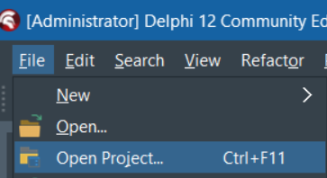
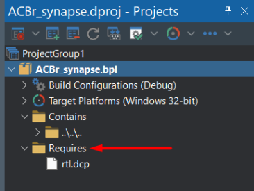
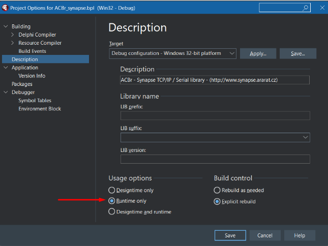
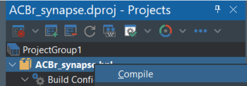
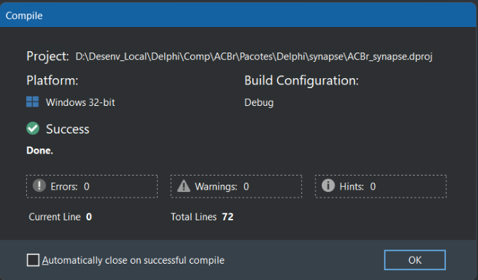
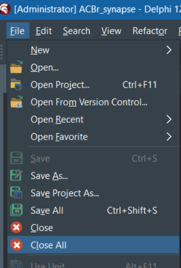
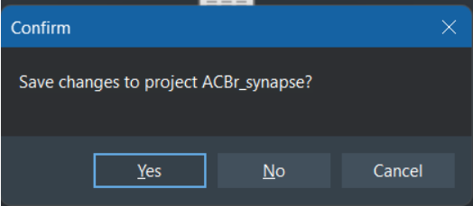
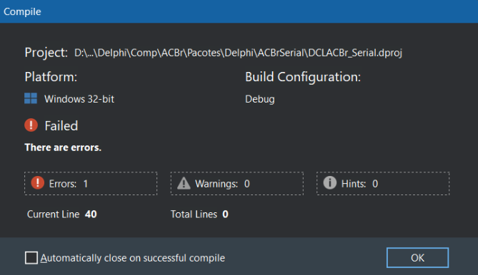
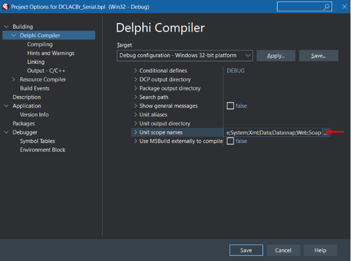
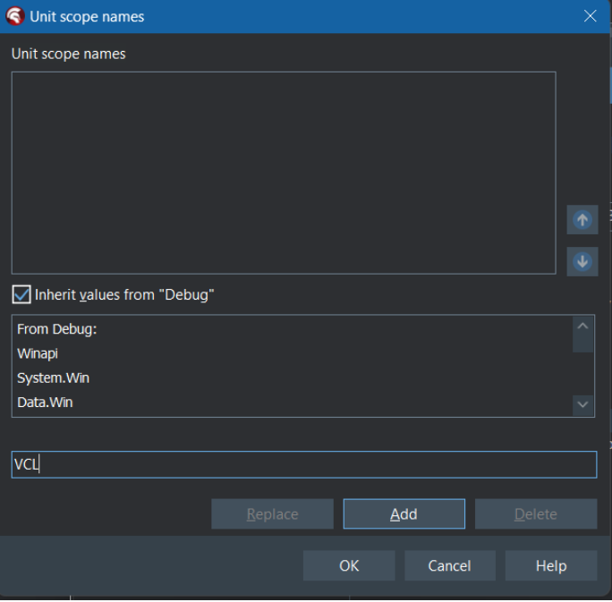

 

## Instalação
Os fontes do projeto ficam hospedados do sourceforge. Para fazer o download dos arquivos, você precisa de um cliente svn. Utilize um de sua preferência e siga para o próximo passo.

## Download do projeto
https://svn.code.sf.net/p/acbr/code/trunk2

## Preparando o ambiente
Após realizar o download dos fontes do projeto, o próximo passo é começar a realizar a instalação dos pacotes base. 
No momento que escrevo esse documento, a última revisão dos fontes foi essa: **36155**

## Atenção
Para fins didáticos, estou realizando a instalação na versão Community Edition do Delphi 12 (Codinome Athenas). 
Mas você pode reproduzir os mesmos passos em outras versões, pois o princípio da instalação manual será a mesma.

## Ajustando os paths
A primeira etapa consiste em ajustar o path de onde o Delphi irá buscar pelos arquivos no momento da instalação. 
Navegue até a opção: Tools > Options.
 

Será aberta a janela de opções. Navegue até a opção: Language > Delphi > Library.

Do lado direito será exibida algumas informações. Vou manter a plataforma de 32bit, mas você pode realizar a instalação em 64bit também se assim preferir. 
Clique no botão em frente ao campo Library path. 

Será aberta a janela com os paths que o Delphi utiliza.

Na janela acima, vamos definir a localização dos fontes do projeto ACBr. Clique no botão que fica em frente ao campo **Greyed items denote invalid path.** 
Será aberta uma janela para você informar o local que deseja adicionar para essa lista de path. Navegue até o local onde você fez o download do projeto ACBr e 
adicione cada um dos diretórios abaixo:

| Local | Diretório |
| --- | --- |
| \\Fontes\\ACBrAndroid | ACBrAndroid |
| \\Fontes\\ACBrCapicom | ACBrCapicom |
| \\Fontes\\ACBrComum | ACBrComum |
| \\Fontes\\ACBrDiversos | ACBrDiversos |
| \\Fontes\\ACBrDiversos\\ACBrFalaWaves | ACBrDiversos\\ACBrFalaWaves |
| \\Fontes\\ACBrIntegrador | ACBrIntegrador |
| \\Fontes\\ACBrIntegrador\\pcnVFPe | ACBrIntegrador\\pcnVFPe |
| \\Fontes\\ACBrOpenSSL | ACBrOpenSSL |
| \\Fontes\\ACBrSerial | ACBrSerial |
| \\Fontes\\ACBrTCP | ACBrTCP |
| \\Fontes\\ACBrTCP\\ConsultaCNPJ | ACBrTCP\\ConsultaCNPJ |
| \\Fontes\\ACBrTXT | ACBrTXT |
| \\Fontes\\ACBrTXT\\ACBrADRCST | ACBrADRCST |
| \\Fontes\\ACBrTXT\\ACBrConvenio115 | ACBrConvenio115 |
| \\Fontes\\ACBrTXT\\ACBrDeSTDA | ACBrDeSTDA |
| \\Fontes\\ACBrTXT\\ACBrEDI | ACBrEDI |
| \\Fontes\\ACBrTXT\\ACBrLCDPR | ACBrLCDPR |
| \\Fontes\\ACBrTXT\\ACBrLFD | ACBrLFD |
| \\Fontes\\ACBrTXT\\ACBrOFX | ACBrOFX |
| \\Fontes\\ACBrTXT\\ACBrPAF | ACBrPAF |
| \\Fontes\\ACBrTXT\\ACBrPonto | ACBrPonto |
| \\Fontes\\ACBrTXT\\ACBrSEF2 | ACBrSEF2 |
| \\Fontes\\ACBrTXT\\ACBrSintegra | ACBrSintegra
| \\Fontes\\ACBrTXT\\ACBrSPED | ACBrSPED |
| \\Fontes\\ACBrTXT\\ACBrSPED\ACBrSPEDContabil | ACBrSPEDContabil |
| \\Fontes\\ACBrTXT\\ACBrSPED\ACBrSPEDECF | ACBrSPEDECF |
| \\Fontes\\ACBrTXT\\ACBrSPED\ACBrSPEDFiscal | ACBrSPEDFiscal |
| \\Fontes\\ACBrTXT\\ACBrSPED\ACBrSPEDFiscalImportar | ACBrSPEDFiscalImportar |
| \\Fontes\\ACBrTXT\\ACBrSPED\ACBrSPEDPisCofins | ACBrSPEDPisCofins |
| \\Fontes\\ACBrTXT\\ACBrSPED\ACBrSPEDPisCofinsImportar | ACBrSPEDPisCofinsImportar |
| \\Fontes\\ACBrTXT\\SintegraSultan | SintegraSultan |
| \\Fontes\\ACBrTEFD | ACBrTEFD |
| \\Fontes\\synapse | synapse |
| \\Fontes\\PCNComum | PCNComum |
| \\Fontes\\Terceiros\\FastStringReplace | Terceiros\\FastStringReplace |
| \\Fontes\\Terceiros\\AJBarCode | Terceiros\\AJBarCode |
| \\Fontes\\Terceiros\\CodeGear | Terceiros\\CodeGear |
| \\Fontes\\Terceiros\\DelphiZXingQRCode | Terceiros\\DelphiZXingQRCode |
| \\Fontes\\Terceiros\\json4delphi | Terceiros\\json4delphi |
| Fontes\\Terceiros\\json4delphi\\src | Terceiros\\json4delphi\\src |
| \\Fontes\\Terceiros\\JsonDataObjects | Terceiros\\JsonDataObjects |
| \\Fontes\\Terceiros\\JsonDataObjects\\Source | Terceiros\\JsonDataObjects\\Source |
| \\Fontes\\Terceiros\\synalist | Terceiros\\synalist |

## Compilando e instalando os pacotes

Agora que temos os paths ajustados, vamos começar a compilar os pacotes. 

Navegue até a opção: File > Open Project

Navegue até o diretório onde você fez o download dos fontes do projeto ACBr.
Vamos iniciar compilando o pacote **ACBr_synapse.dpk** que fica no diretório: **\Pacotes\Delphi\synapse**.

Sempre que for compilar um pacote, se atente ao diretório **Requires**. Observe que para o caso do **ACBr_synapse**, 
ele precisa apenas do arquivo rtl.dcp que já é parte integrante do Delphi.

Clique com o botão direito do mouse sobre o pacote **ACBr_synapse.bpl** e navegue até a opção Options.

Na janela que abrir, navegue até a opção Building > Description. Observe que o pacote ACBr_synapse se trata de um pacote **Runtime only**. 
Isso significa que não precisamos instalá-lo, apenas compilá-lo para que ele gere o arquivo **ACBr_synapse.bpl** que será utilizado por outros pacotes do projeto.

Fecha a janela anterior, clique novamente com o botão direito sobre o arquivo **ACBr_synapse.bpl** e clique na opção Compile.

Será aberta a janela com o resultado da compilação.

Como não precisamos instalá-lo, basta clicar no botão Ok para fechar a janela de retorno da compilação. Agora, navegue até a opção: File > Close All.

Será apresentada uma janela de confirmação questionando se deseja salvar as alterações. Basta clicar em No.

Iremos repetir toda essa etapa para todos os demais pacotes que iremos instalar.

Siga a ordem abaixo.

| Sequência | Local | Pacote | Compilar | Instalar |
| --- | --- | --- | --- | --- |
| 1   | \\Pacotes\\Delphi\\ACBrComum\\ | ACBr_Comum.dpk | Sim | Não |
| 2   | \\Pacotes\\Delphi\\ACBrComum\\ | DCLACBr_Comum.dpk | Sim | Sim |
|     |     |     |     |     |
| 1   | \\Pacotes\\Delphi\\ACBrOpenSSL\\ | ACBr_OpenSSL.dpk | Sim | Não |
| 2   | \\Pacotes\\Delphi\\ACBrOpenSSL\\ | DCLACBr_OpenSSL.dpk | Sim | Sim |
|     |     |     |     |     |
| 1   | \\Pacotes\\Delphi\\ACBrDiversos\\ | ACBr_Diversos.dpk | Sim | Não |
| 2   | \\Pacotes\\Delphi\\ACBrDiversos\\ | DCLACBr_Diversos.dpk | Sim | Sim |
|     |     |     |     |     |
| 1   | \\Pacotes\\Delphi\\PCNComum | ACBr_PCNComum.dpk | Sim | Não |
|     |     |     |     |     |
| 1   | \\Pacotes\\Delphi\\ACBrIntegrador\\ | ACBr_Integrador.dpk | Sim | Não |
| 2   | \\Pacotes\\Delphi\\ACBrIntegrador\\ | DCLACBr_Integrador.dpk | Sim | Sim |
|     |     |     |     |     |
| 1   | \\Pacotes\\Delphi\\ACBrSerial\\ | ACBr_Serial.dpk | Sim | Não |
| 2   | \\Pacotes\\Delphi\\ACBrSerial\\ | DCLACBr_Serial.dpk | Sim | Sim |
|     |     |     |     |     |
| 1   | \\Pacotes\\Delphi\\ACBrTCP\\ | ACBr_TCP.dpk | Sim | Não |
| 2   | \\Pacotes\\Delphi\\ACBrTCP\\ | DCLACBr_TCP.dpk | Sim | Sim |
|     |     |     |     |     |
| 1   | \\Pacotes\\Delphi\\ACBrTCP\\ | ACBr_MTER.dpk | Sim | Não |
| 2   | \\Pacotes\\Delphi\\ACBrTCP\\ | DCLACBr_MTER.dpk | Sim | Sim |
|     |     |     |     |     |
| 1   | \\Pacotes\\Delphi\\ACBrAndroid\\ | ACBr_Android.dpk | Sim | Não |
| 2   | \\Pacotes\\Delphi\\ACBrAndroid\\ | DCLACBr_Android.dpk | Sim | Sim |
|     |     |     |     |     |
| 1   | \\Pacotes\\Delphi\\ACBrTEFD\\ | ACBr_TEFD.dpk | Sim | Não |
| 2   | \\Pacotes\\Delphi\\ACBrTEFD\\ | DCLACBr_TEFD.dpk | Sim | Sim |
|     |     |     |     |     |
| 1   | \\Pacotes\\Delphi\\ACBrTXT\\ | ACBr_TXTComum.dpk | Sim | Não |
|     |     |     |     |     |
| 1   | \\Pacotes\\Delphi\\ACBrTXT\\ACBrADRCST\\ | ACBr_ADRCST.dpk | Sim | Não |
| 2   | \\Pacotes\\Delphi\\ACBrTXT\\ACBrADRCST\\ | DCLACBr_ADRCST.dpk | Sim | Sim |
|     |     |     |     |     |
| 1   | \\Pacotes\\Delphi\\ACBrTXT\\ACBrConvenio115\\ | ACBr_Convenio115.dpk | Sim | Não |
| 2   | \\Pacotes\\Delphi\\ACBrTXT\\ACBrConvenio115\\ | DCLACBr_Convenio115.dpk | Sim | Sim |
|     |     |     |     |     |
| 1   | \\Pacotes\\Delphi\\ACBrTXT\\ACBrDeSTDA\\ | ACBr_DeSTDA.dpk | Sim | Não |
| 2   | \\Pacotes\\Delphi\\ACBrTXT\\ACBrDeSTDA\\ | DCLACBr_DeSTDA.dpk | Sim | Sim |
|     |     |     |     |     |
| 1   | \\Pacotes\\Delphi\\ACBrTXT\\ACBrEDI\\ | ACBr_EDI.dpk | Sim | Não |
| 2   | \\Pacotes\\Delphi\\ACBrTXT\\ACBrEDI\\ | DCLACBr_EDI.dpk | Sim | Sim |
|     |     |     |     |     |
| 1   | \\Pacotes\\Delphi\\ACBrTXT\\ACBrLCDPR\\ | ACBr_LCDPR.dpk | Sim | Não |
| 2   | \\Pacotes\\Delphi\\ACBrTXT\\ACBrLCDPR\\ | DCLACBr_LCDPR.dpk | Sim | Sim |
|     |     |     |     |     |
| 1   | \\Pacotes\\Delphi\\ACBrTXT\\ACBrLFD\\ | ACBr_LFD.dpk | Sim | Não |
| 2   | \\Pacotes\\Delphi\\ACBrTXT\\ACBrLFD\\ | DCLACBr_LFD.dpk | Sim | Sim |
|     |     |     |     |     |
| 1   | \\Pacotes\\Delphi\\ACBrTXT\\ACBrOFX\\ | ACBr_OFX.dpk | Sim | Não |
| 2   | \\Pacotes\\Delphi\\ACBrTXT\\ACBrOFX\\ | DCLACBr_OFX.dpk | Sim | Sim |
|     |     |     |     |     |
| 1   | \\Pacotes\\Delphi\\ACBrTXT\\ACBrPAF\\ | ACBr_PAF.dpk | Sim | Não |
| 2   | \\Pacotes\\Delphi\\ACBrTXT\\ACBrPAF\\ | DCLACBr_PAF.dpk | Sim | Sim |

## Ponto de Atenção

Ao compilar o pacote DCLACBr_Serial.dpk você pode se deparar com esse erro:

Devido as versões mais recentes do Delphi adotarem a nomenclatura de namespaces, alguns itens não fazem referência a ela, ocasionando o erro acima. Para resolvê-lo, você precisa fazer o seguinte:

Clique com o botão direito sobre o **DCLACBr_Serial.bpl** e navegue até a opção Options.

Na tela que abrir, navegue até Building  > Delphi Compiler. Clique no botão que fica em frente ao campo **Unit scope names**.

Na janela que abrir, digite **VCL** no campo e clique no botão **Add**. Em seguida, clique no botão **Ok** e na outra janela, clique no botão **Save**.

Agora, basta recompilar o pacote **ACBr_Serial** e perceba que o erro não vai aparecer.

Esse mesmo procedimento deverá ser realizada para outros pacotes que apresentem esse mesmo erro no momento da compilação.
