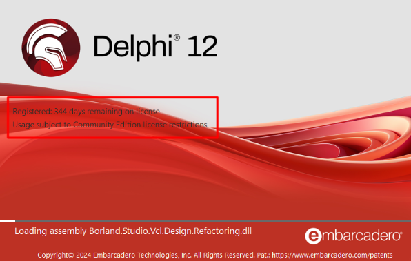

 

## Instalação
Os fontes do projeto ficam hospedados do sourceforge. Para fazer o download dos arquivos, você precisa de um cliente svn. Utilize um de sua preferência e siga para o próximo passo.

## Download do projeto
https://svn.code.sf.net/p/acbr/code/trunk2

## Preparando o ambiente
Após realizar o download dos fontes do projeto, o próximo passo é começar a realizar a instalação dos pacotes base. 
No momento que escrevo esse documento, a última revisão dos fontes foi essa: **36155**

## Atenção
Para fins didáticos, estou realizando a instalação na versão Community Edition do Delphi 12 (Codinome Athenas). 
Mas você pode reproduzir os mesmos passos em outras versões, pois o princípio da instalação manual será a mesma.

## Ajustando os paths
A primeira etapa consiste em ajustar o path de onde o Delphi irá buscar pelos arquivos no momento da instalação. 
Navegue até a opção: Tools > Options.
 

Será aberta a janela de opções. Navegue até a opção: Language > Delphi > Library.

Do lado direito será exibida algumas informações. Vou manter a plataforma de 32bit, mas você pode realizar a instalação em 64bit também se assim preferir. 
Clique no botão em frente ao campo Library path. 

Será aberta a janela com os paths que o Delphi utiliza.

Na janela acima, vamos definir a localização dos fontes do projeto ACBr. Clique no botão que fica em frente ao campo **Greyed items denote invalid path.** 
Será aberta uma janela para você informar o local que deseja adicionar para essa lista de path. Navegue até o local onde você fez o download do projeto ACBr e 
adicione cada um dos diretórios abaixo:

| Local | Diretório |
| --- | --- |
| \\Fontes\\ACBrAndroid | ACBrAndroid |
| \\Fontes\\ACBrCapicom | ACBrCapicom |
| \\Fontes\\ACBrComum | ACBrComum |
| \\Fontes\\ACBrDiversos | ACBrDiversos |
| \\Fontes\\ACBrDiversos\\ACBrFalaWaves | ACBrDiversos\\ACBrFalaWaves |
| \\Fontes\\ACBrIntegrador | ACBrIntegrador |
| \\Fontes\\ACBrIntegrador\\pcnVFPe | ACBrIntegrador\\pcnVFPe |
| \\Fontes\\ACBrOpenSSL | ACBrOpenSSL |
| \\Fontes\\ACBrSerial | ACBrSerial |
| \\Fontes\\ACBrTCP | ACBrTCP |
| \\Fontes\\ACBrTCP\\ConsultaCNPJ | ACBrTCP\\ConsultaCNPJ |
| \\Fontes\\ACBrTXT | ACBrTXT |
| \\Fontes\\ACBrTEFD | ACBrTEFD |
| \\Fontes\\synapse | synapse |
| \\Fontes\\PCNComum | PCNComum |
| \\Fontes\\Terceiros\\FastStringReplace | Terceiros\\FastStringReplace |
| \\Fontes\\Terceiros\\AJBarCode | Terceiros\\AJBarCode |
| \\Fontes\\Terceiros\\CodeGear | Terceiros\\CodeGear |
| \\Fontes\\Terceiros\\DelphiZXingQRCode | Terceiros\\DelphiZXingQRCode |
| \\Fontes\\Terceiros\\json4delphi | Terceiros\\json4delphi |
| Fontes\\Terceiros\\json4delphi\\src | Terceiros\\json4delphi\\src |
| \\Fontes\\Terceiros\\JsonDataObjects | Terceiros\\JsonDataObjects |
| \\Fontes\\Terceiros\\JsonDataObjects\\Source | Terceiros\\JsonDataObjects\\Source |
| \\Fontes\\Terceiros\\synalist | Terceiros\\synalist |
